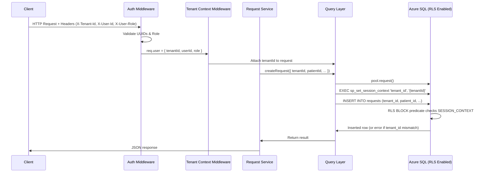

# Multi-Tenant Architecture with Azure SQL Row-Level Security

> **⚠️ Demo/POC Notice**: This document explains a proof-of-concept multi-tenant architecture. The header-based authentication (`X-Tenant-Id`, `X-User-Id`, `X-User-Role`) is for demonstration purposes only and would be replaced with OAuth 2.0/MSAL/JWT validation in a production environment.

## Table of Contents

- [Introduction](#introduction)
- [Architecture Overview](#architecture-overview)
- [Azure SQL Multi-Tenant Patterns](#azure-sql-multi-tenant-patterns)
- [How Row-Level Security Works](#how-row-level-security-works)
- [SESSION_CONTEXT: The Glue](#session_context-the-glue)
- [Application Code Walkthrough](#application-code-walkthrough)
- [Proving It Works: The SQL Explorer](#proving-it-works-the-sql-explorer)
- [Connection & Authentication](#connection--authentication)
- [Scaling Considerations](#scaling-considerations)
- [Resources & Links](#resources--links)

---

## Introduction

### What is Multi-Tenancy?

Multi-tenancy is an architecture where a single instance of a software application serves multiple customers (tenants). Each tenant's data is logically isolated from other tenants, even though it may be stored in the same physical database. This approach is fundamental to modern SaaS applications, enabling:

- **Cost efficiency** — Share infrastructure across tenants
- **Operational efficiency** — Manage one application/database instead of many
- **Scalability** — Add new tenants without provisioning new infrastructure
- **Maintenance** — Deploy updates once for all tenants

### What This Demo Shows

**MedRequest** is a patient communication platform that demonstrates how to build a multi-tenant application using **Azure SQL Database with Row-Level Security (RLS)** and **SESSION_CONTEXT**. The key features:

1. **Database-level tenant isolation** — No tenant can see another tenant's data
2. **Transparent filtering** — Application code doesn't need WHERE clauses on `tenant_id`
3. **Write protection** — Prevents accidental cross-tenant data writes
4. **Production-ready pattern** — Real SQL Server feature, not an ORM trick

The beauty of this approach? Your business logic remains **tenant-unaware**. RLS does the heavy lifting at the database engine level.

---

## Architecture Overview

### Request Flow Diagram



### Key Components

1. **Auth Middleware** — Extracts tenant identity from request headers
2. **Tenant Context Middleware** — Validates DB connectivity and attaches `tenantId` to request
3. **Query Layer** — Sets `SESSION_CONTEXT('tenant_id')` before every SQL operation
4. **RLS Policies** — Database-level filters and blocks enforced by SQL engine
5. **Connection Pool** — Shared pool with Azure AD managed identity support

---

## Azure SQL Multi-Tenant Patterns

Microsoft provides several strategies for multi-tenant SaaS applications. Understanding these helps you choose the right approach for your scale and isolation requirements.

### Pattern Comparison

| Pattern | Scale | Tenant Isolation | Cost per Tenant | Development Complexity | When to Use |
|---------|-------|------------------|-----------------|------------------------|-------------|
| **Standalone DB per Tenant** | Low (1-100s) | Highest | Highest | Low | Regulated industries, premium tiers |
| **Database per Tenant + Elastic Pools** | High (1-100,000s) | High | Medium | Low-Medium | Growing SaaS with varied workloads |
| **Single DB with RLS** (this demo) | Medium (1-10,000s) | Medium | Low | Medium | Cost-sensitive, standard isolation |
| **Sharded Multi-Tenant DBs** | Unlimited (1M+) | Low-Medium | Lowest | High | Massive scale, many small tenants |

### 1. Database per Tenant (with Elastic Pools)

Each tenant gets their own database. Databases in the same resource group are grouped into **elastic pools** to share compute resources.

**Pros:**
- Strong tenant isolation
- Schema customization per tenant
- Easy tenant backup/restore
- Point-in-time recovery per tenant

**Cons:**
- Management overhead grows with tenant count
- Higher cost than shared DB approaches
- Schema migrations across 1000s of DBs requires automation

**Microsoft Learn:** [Database-per-tenant pattern](https://learn.microsoft.com/azure/azure-sql/database/saas-tenancy-app-design-patterns#d-multitenant-app-with-database-per-tenant)

### 2. Single Database with Row-Level Security (MedRequest's Approach)

All tenants share one database. **Row-Level Security** enforces tenant isolation at the database engine level by filtering rows based on `SESSION_CONTEXT`.

**Pros:**
- Lowest infrastructure cost
- Simplified schema migrations (one database)
- Transparent filtering (application doesn't need explicit `WHERE tenant_id` clauses)
- Built-in SQL Server feature (production-ready)

**Cons:**
- All tenants share compute/storage resources
- "Noisy neighbor" risk (one tenant's workload can impact others)
- Cannot customize schema per tenant
- Restore/backup is all-or-nothing

**Microsoft Learn:** [Multitenant database pattern](https://learn.microsoft.com/azure/azure-sql/database/saas-tenancy-app-design-patterns#e-multitenant-app-with-multitenant-databases)

### 3. Sharded Multi-Tenant Databases

Tenant data is distributed across multiple databases (shards). Each shard contains many tenants. As you scale, you add more shards.

**Pros:**
- Near-infinite scale
- Balance load across shards
- Can move high-value tenants to dedicated shards

**Cons:**
- Complex shard management (split/merge operations)
- Cross-tenant queries are difficult
- Requires catalog database to map tenants → shards

**Microsoft Learn:** [Sharded multitenant pattern](https://learn.microsoft.com/azure/azure-sql/database/saas-tenancy-app-design-patterns#g-multitenant-app-with-sharded-multitenant-databases)

### Why We Chose RLS for This POC

For a **growing SaaS application** with standard isolation needs, the single-database-with-RLS pattern offers the best balance of:

- **Developer velocity** — Write normal SQL queries, RLS handles filtering
- **Cost efficiency** — No per-tenant databases or elastic pool overhead
- **Production readiness** — RLS is a core SQL Server feature, not a library or ORM abstraction

When you outgrow this pattern (thousands of tenants with heavy workloads), you can **graduate to elastic pools or sharding** without rewriting application logic — just change where `tenantId` routes data.

---

## How Row-Level Security Works

### What is RLS?

**Row-Level Security (RLS)** is a database feature that restricts row access based on the user executing a query. In multi-tenant scenarios, we use it to filter rows by `tenant_id` matching the authenticated tenant.

**Microsoft Learn:** [Row-Level Security Documentation](https://learn.microsoft.com/sql/relational-databases/security/row-level-security)

### RLS Components

1. **Security Predicate Function** — Returns `1` (allow) or `0` (deny) for each row
2. **Security Policy** — Binds predicates to tables
3. **Predicate Types:**
   - **FILTER Predicate** — Silently filters rows on `SELECT`, `UPDATE`, `DELETE` (read operations)
   - **BLOCK Predicate** — Explicitly blocks writes (`INSERT`, `UPDATE`, `DELETE`) that violate the policy

### MedRequest's RLS Schema

<!-- db/migrations/001-initial-schema.sql -->

```sql
-- Security predicate function: returns rows where tenant_id matches SESSION_CONTEXT
CREATE FUNCTION dbo.fn_tenant_filter(@tenant_id UNIQUEIDENTIFIER)
RETURNS TABLE
WITH SCHEMABINDING
AS
    RETURN SELECT 1 AS result
    WHERE @tenant_id = CAST(SESSION_CONTEXT(N'tenant_id') AS UNIQUEIDENTIFIER);
GO

-- Apply RLS policy to users table
CREATE SECURITY POLICY dbo.UsersFilter
    ADD FILTER PREDICATE dbo.fn_tenant_filter(tenant_id) ON dbo.users,
    ADD BLOCK  PREDICATE dbo.fn_tenant_filter(tenant_id) ON dbo.users AFTER INSERT
    WITH (STATE = ON);
GO

-- Apply RLS policy to requests table
CREATE SECURITY POLICY dbo.RequestsFilter
    ADD FILTER PREDICATE dbo.fn_tenant_filter(tenant_id) ON dbo.requests,
    ADD BLOCK  PREDICATE dbo.fn_tenant_filter(tenant_id) ON dbo.requests AFTER INSERT
    WITH (STATE = ON);
GO
```

### How It Works

#### FILTER Predicate (Reads)

When you execute:

```sql
SELECT * FROM requests;  -- No WHERE clause!
```

SQL Server **automatically** transforms it to:

```sql
SELECT * FROM requests
WHERE tenant_id = SESSION_CONTEXT(N'tenant_id');
```

The application code **doesn't need to know** about tenant filtering. The database engine handles it transparently.

#### BLOCK Predicate (Writes)

When you execute:

```sql
INSERT INTO requests (tenant_id, patient_id, subject, ...)
VALUES ('wrong-tenant-id', ...);
```

SQL Server **rejects the INSERT** if the `tenant_id` value doesn't match `SESSION_CONTEXT(N'tenant_id')`. This prevents:

- Accidental cross-tenant writes
- Malicious attempts to insert data for another tenant
- Application bugs that pass the wrong tenant ID

### Table Schema with Tenant ID

Every multi-tenant table includes a `tenant_id` column:

```sql
CREATE TABLE requests (
    id          UNIQUEIDENTIFIER PRIMARY KEY DEFAULT NEWID(),
    tenant_id   UNIQUEIDENTIFIER NOT NULL,  -- ← Multi-tenant key
    patient_id  UNIQUEIDENTIFIER NOT NULL,
    subject     NVARCHAR(500)    NOT NULL,
    status      NVARCHAR(20)     NOT NULL DEFAULT 'new',
    created_at  DATETIME2        NOT NULL DEFAULT SYSUTCDATETIME(),

    CONSTRAINT FK_requests_tenant  FOREIGN KEY (tenant_id)  REFERENCES tenants(id),
    CONSTRAINT FK_requests_patient FOREIGN KEY (patient_id) REFERENCES users(id)
);

CREATE INDEX IX_requests_tenant_id ON requests (tenant_id);  -- ← Critical for RLS performance
```

**Performance Note:** Always index `tenant_id` columns. RLS predicates are evaluated on every row, so the database needs fast lookups.

---

## SESSION_CONTEXT: The Glue

### What is SESSION_CONTEXT?

`SESSION_CONTEXT` is a **session-scoped key-value store** built into SQL Server. You set values using `sp_set_session_context`, and read them using the `SESSION_CONTEXT(N'key')` function.

**Microsoft Learn:**
- [sp_set_session_context](https://learn.microsoft.com/sql/relational-databases/system-stored-procedures/sp-set-session-context-transact-sql)
- [SESSION_CONTEXT function](https://learn.microsoft.com/sql/t-sql/functions/session-context-transact-sql)

### How We Use It

At the **start of every request**, we set the authenticated tenant's ID:

```sql
EXEC sp_set_session_context @key = N'tenant_id', @value = '12345678-abcd-...'
```

Now every RLS predicate can read this value:

```sql
-- Inside fn_tenant_filter
WHERE @tenant_id = CAST(SESSION_CONTEXT(N'tenant_id') AS UNIQUEIDENTIFIER)
```

### Session Context and Connection Pooling

**Critical Design Decision:** SESSION_CONTEXT is **connection-scoped**, not transaction-scoped. With connection pooling, a single physical connection can serve multiple requests for different tenants.

**Our Solution:** Set `SESSION_CONTEXT` **on every request**, before running any queries.

<!-- src/api/db/queries.js -->

```javascript
async function setTenantContext(request, tenantId) {
  await request.query(
    `EXEC sp_set_session_context @key = N'tenant_id', @value = '${tenantId}'`
  );
}

async function createRequest({ tenantId, patientId, type, subject, body }) {
  const pool = await getPool();
  const request = pool.request();

  // STEP 1: Set tenant context FIRST
  await setTenantContext(request, tenantId);

  // STEP 2: Now run the actual query
  const result = await request
    .input('tenant_id',  sql.UniqueIdentifier, tenantId)
    .input('patient_id', sql.UniqueIdentifier, patientId)
    .input('subject',    sql.NVarChar(500),    subject)
    .query(`
      INSERT INTO requests (tenant_id, patient_id, type, subject, body)
      OUTPUT INSERTED.*
      VALUES (@tenant_id, @patient_id, @type, @subject, @body)
    `);

  return result.recordset[0];
}
```

### Why Not Use a WHERE Clause?

You might ask: "Why not just add `WHERE tenant_id = @tenant_id` to every query?"

**RLS Benefits:**

1. **Defense in Depth** — Even if a developer forgets the WHERE clause, RLS prevents data leaks
2. **Centralized Enforcement** — Security logic lives in the database, not scattered across 100 query files
3. **Audit Trail** — Database administrators can see which tables are RLS-protected
4. **Write Protection** — BLOCK predicates prevent cross-tenant INSERTs, which WHERE clauses can't do

---

## Application Code Walkthrough

### Layer 1: Auth Middleware

**Purpose:** Extract tenant identity from request headers and validate format.

<!-- src/api/middleware/auth.js -->

```javascript
const UUID_RE = /^[0-9a-f]{8}-[0-9a-f]{4}-[0-9a-f]{4}-[0-9a-f]{4}-[0-9a-f]{12}$/i;
const VALID_ROLES = ['patient', 'concierge', 'case_manager'];

function auth(req, res, next) {
  const tenantId = req.headers['x-tenant-id'];
  const userId   = req.headers['x-user-id'];
  let userRole   = req.headers['x-user-role'];

  // Validate presence
  if (!tenantId || !userId || !userRole) {
    return res.status(401).json({
      error: 'Missing required auth headers: X-Tenant-Id, X-User-Id, X-User-Role',
    });
  }

  // Validate UUID format (prevents SQL injection via tenant_id)
  if (!UUID_RE.test(tenantId) || !UUID_RE.test(userId)) {
    return res.status(400).json({ error: 'Invalid UUID format' });
  }

  // Validate role
  if (!VALID_ROLES.includes(userRole)) {
    return res.status(400).json({
      error: `X-User-Role must be one of: ${VALID_ROLES.join(', ')}`,
    });
  }

  // Attach to request object
  req.user = { tenantId, userId, role: userRole };
  next();
}
```

**Key Security Note:** We validate `tenantId` is a proper UUID **before** it ever reaches the database. This prevents injection attacks, even though we use it in `sp_set_session_context`.

### Layer 2: Tenant Context Middleware

**Purpose:** Validate database connectivity and propagate `tenantId` to request object.

<!-- src/api/middleware/tenantContext.js -->

```javascript
const { getPool } = require('../db/pool');

async function tenantContext(req, res, next) {
  try {
    // Validate DB pool is reachable
    await getPool();
    
    // Attach tenantId for downstream use
    req.tenantId = req.user.tenantId;
    
    next();
  } catch (err) {
    next(err);
  }
}
```

**Why a Separate Middleware?** This creates a clear separation of concerns:
- **Auth Middleware** — Who is this user? (Authentication)
- **Tenant Context Middleware** — Can we reach the database? (Infrastructure health)
- **Query Layer** — Set SESSION_CONTEXT and execute queries

### Layer 3: Query Layer

**Purpose:** Set `SESSION_CONTEXT` before every query, then execute parameterized SQL.

<!-- src/api/db/queries.js -->

```javascript
const { getPool, sql } = require('./pool');

async function setTenantContext(request, tenantId) {
  await request.query(
    `EXEC sp_set_session_context @key = N'tenant_id', @value = '${tenantId}'`
  );
}

async function getRequests(tenantId, filters = {}) {
  const pool = await getPool();
  const request = pool.request();

  // CRITICAL: Set tenant context FIRST
  await setTenantContext(request, tenantId);

  // Build query (notice: no WHERE tenant_id clause needed!)
  let query = 'SELECT * FROM requests WHERE 1=1';

  if (filters.status) {
    request.input('status', sql.NVarChar(20), filters.status);
    query += ' AND status = @status';
  }

  query += ' ORDER BY created_at DESC';

  const result = await request.query(query);
  return result.recordset;
}

async function updateRequestStatus(tenantId, requestId, status) {
  const pool = await getPool();
  const request = pool.request();

  await setTenantContext(request, tenantId);

  const result = await request
    .input('id',     sql.UniqueIdentifier, requestId)
    .input('status', sql.NVarChar(20),     status)
    .query(`
      UPDATE requests
      SET status = @status, updated_at = SYSUTCDATETIME()
      OUTPUT INSERTED.*
      WHERE id = @id  -- No tenant_id check needed, RLS handles it
    `);

  return result.recordset[0] || null;
}
```

**Pattern:** Every query function follows this structure:

1. Get connection pool
2. Create request object
3. **Set SESSION_CONTEXT**
4. Add parameters
5. Execute query
6. Return results

### Layer 4: Service Layer (Tenant-Unaware!)

**Purpose:** Business logic with validation. Notice: **no tenant filtering logic**.

<!-- src/api/services/requestService.js -->

```javascript
const queries = require('../db/queries');

async function createRequest({ tenantId, patientId, type, subject, body }) {
  // Validation logic
  if (!subject || subject.trim().length === 0) {
    const err = new Error('Subject is required');
    err.statusCode = 400;
    throw err;
  }

  // Delegate to query layer — no tenant logic here!
  return queries.createRequest({ tenantId, patientId, type, subject, body });
}

async function listRequests(tenantId, filters = {}) {
  // Business logic doesn't care about tenant filtering
  return queries.getRequests(tenantId, filters);
}
```

**Why This Matters:** Your business logic focuses on **what** to do, not **how** to filter by tenant. The query layer + RLS handle isolation automatically.

---

## Proving It Works: The SQL Explorer

### The "Behind the Scenes" Feature

MedRequest includes a **debug endpoint** (`/api/debug/explore`) that lets you run pre-defined SQL queries through the same auth + tenant context flow as the rest of the application.

**Purpose:** Demonstrate that RLS filtering happens **at the database level**, not in application code.

<!-- src/api/routes/debug.js -->

```javascript
const QUERY_CATALOG = {
  my_requests: {
    sql: 'SELECT id, subject, type, status, created_at FROM requests',
    rlsNote: 'This query selects from the full requests table with no WHERE clause, but Row-Level Security filtered results to only show {tenantName} data.'
  },

  all_users: {
    sql: 'SELECT id, name, role FROM users',
    rlsNote: 'This query selects every user in the system, but RLS ensures only {tenantName} users are returned.'
  },

  cross_tenant_proof: {
    sql: `
      SELECT t.name AS tenant_name, COUNT(r.id) AS request_count
      FROM requests r
      JOIN tenants t ON r.tenant_id = t.id
      GROUP BY t.name
    `,
    rlsNote: 'This query JOINs requests to tenants and groups by tenant name — attempting to see ALL tenants. RLS ensures only {tenantName} data appears in the result.'
  }
};

router.post('/explore', async (req, res, next) => {
  const { queryKey } = req.body;
  const tenantId = req.tenantId;  // From auth middleware

  const pool = await getPool();
  const request = pool.request();
  
  // SAME flow as every other endpoint
  await setTenantContext(request, tenantId);

  const result = await request.query(QUERY_CATALOG[queryKey].sql);

  res.json({
    queryKey,
    sql: QUERY_CATALOG[queryKey].sql,
    tenantId,
    rowCount: result.recordset.length,
    rows: result.recordset,
    rlsNote: QUERY_CATALOG[queryKey].rlsNote
  });
});
```

### The Cross-Tenant Proof Query

The most powerful demonstration is `cross_tenant_proof`:

```sql
SELECT t.name AS tenant_name, COUNT(r.id) AS request_count
FROM requests r
JOIN tenants t ON r.tenant_id = t.id
GROUP BY t.name
```

**Expected Behavior Without RLS:** This query would return all tenants in the system.

**Actual Behavior With RLS:** Only the authenticated tenant appears in the results.

**Why?** The RLS FILTER predicate on the `requests` table automatically adds:

```sql
WHERE r.tenant_id = SESSION_CONTEXT(N'tenant_id')
```

Even though the query JOINs to the `tenants` table (which is **not** RLS-protected), the filtering happens on the `requests` side, so only one tenant's data flows through the JOIN.

---

## Connection & Authentication

### Connection Pool with Azure AD Managed Identity

MedRequest uses the **node-mssql** package for Azure SQL connectivity, with support for **Azure AD managed identity** authentication.

**npm Package:** [node-mssql](https://www.npmjs.com/package/mssql)

<!-- src/api/db/pool.js -->

```javascript
const sql = require('mssql');

function buildDbConfig() {
  const dbConfig = {
    server:   config.db.server,
    database: config.db.database,
    port:     config.db.port,
    options:  config.db.options,
    pool:     {
      min: 2,
      max: 10
    }
  };

  if (config.db.useManagedIdentity) {
    // Azure AD authentication via managed identity
    dbConfig.authentication = {
      type: 'azure-active-directory-default',
    };
  } else {
    // SQL Server authentication (local dev)
    dbConfig.user     = config.db.user;
    dbConfig.password = config.db.password;
  }

  return dbConfig;
}

async function getPool() {
  if (pool) return pool;

  const dbConfig = buildDbConfig();
  pool = await new sql.ConnectionPool(dbConfig).connect();

  pool.on('error', (err) => {
    console.error('[DB] Pool error:', err.message);
    pool = null;
  });

  return pool;
}
```

### Managed Identity Benefits

**Passwordless Authentication:**
- No connection strings with passwords
- Credentials managed by Azure (automatic rotation)
- Uses Azure AD identities (User-Assigned or System-Assigned managed identities)

**How It Works:**
1. Your Azure App Service/Container App has a managed identity enabled
2. You grant that identity SQL permissions: `db_datareader`, `db_datawriter`, `db_ddladmin`
3. The `azure-active-directory-default` auth type uses Azure's credential chain:
   - Managed Identity (in Azure)
   - Azure CLI (local dev)
   - Environment variables

**Microsoft Learn:** [Use managed identities with Azure SQL](https://learn.microsoft.com/azure/app-service/tutorial-connect-msi-sql-database)

### Connection Pooling Strategy

**Pool Configuration:**
- **Min connections:** 2 (keep warm connections)
- **Max connections:** 10 (limit concurrent requests)

**Why Pooling Works with SESSION_CONTEXT:**

Because we call `setTenantContext(request, tenantId)` **on every request**, the same physical connection can safely serve multiple tenants:

1. Request 1 (Tenant A) → Set SESSION_CONTEXT → Query → Return connection to pool
2. Request 2 (Tenant B) → Set SESSION_CONTEXT → Query → Return connection to pool

The SESSION_CONTEXT value is **overwritten** each time, so there's no cross-contamination.

---

## Scaling Considerations

### When to Graduate from RLS

**Stay with RLS when:**
- You have < 10,000 tenants
- Tenants have similar workload patterns
- Cost efficiency is a priority
- You can tolerate shared compute resources

**Graduate to Database-per-Tenant + Elastic Pools when:**
- You need tenant-specific schema customization
- You have regulatory requirements for physical data isolation
- Noisy neighbor issues become frequent
- You need per-tenant backup/restore without downtime

**Graduate to Sharding when:**
- You have 100,000+ tenants
- You're hitting single-database scale limits (storage, IOPS)
- Most tenants are small/inactive (perfect for multi-tenant shards)

### Migration Path

The beauty of this architecture: **you can migrate without rewriting application code**.

#### From RLS to Elastic Pools

1. Create a new database per tenant
2. Update routing logic to look up tenant → database mapping
3. Still use RLS in each database (extra safety)
4. `SESSION_CONTEXT` calls remain the same

#### From Elastic Pools to Sharding

1. Deploy [Elastic Database Tools](https://learn.microsoft.com/azure/azure-sql/database/elastic-scale-introduction)
2. Create a **shard map** (tenant → shard mapping)
3. Use the [Elastic Database Client Library](https://learn.microsoft.com/azure/azure-sql/database/elastic-database-client-library) to route queries
4. Continue using RLS within each shard

### Performance Optimization

#### Indexing for RLS

**Always index `tenant_id` columns:**

```sql
CREATE INDEX IX_requests_tenant_id ON requests (tenant_id);
CREATE INDEX IX_users_tenant_id    ON users    (tenant_id);
```

RLS predicates add an implicit `WHERE tenant_id = ...` to every query. Without an index, this becomes a full table scan.

#### Composite Indexes

For common query patterns, create multi-column indexes:

```sql
-- Optimize: SELECT * FROM requests WHERE status = 'new' ORDER BY created_at DESC
CREATE INDEX IX_requests_tenant_status ON requests (tenant_id, status, created_at);
```

**Index Column Order:** Put `tenant_id` first. The query optimizer can use this index for:
1. RLS filtering (tenant_id)
2. Status filtering
3. Sorting by created_at

#### Monitor RLS Overhead

Use Azure SQL's **Query Performance Insight** to identify slow queries. Look for:

- Table scans on RLS-protected tables
- Missing indexes on `tenant_id`
- Queries that retrieve large result sets (consider pagination)

**Microsoft Learn:** [Query Performance Insight](https://learn.microsoft.com/azure/azure-sql/database/query-performance-insight-use)

---

## Resources & Links

### Row-Level Security

- **[Row-Level Security Overview](https://learn.microsoft.com/sql/relational-databases/security/row-level-security)** — Core RLS documentation
- **[Create Security Policy (T-SQL)](https://learn.microsoft.com/sql/t-sql/statements/create-security-policy-transact-sql)** — Syntax reference

### SESSION_CONTEXT

- **[sp_set_session_context](https://learn.microsoft.com/sql/relational-databases/system-stored-procedures/sp-set-session-context-transact-sql)** — Set session variables
- **[SESSION_CONTEXT Function](https://learn.microsoft.com/sql/t-sql/functions/session-context-transact-sql)** — Read session variables

### Multi-Tenant Patterns

- **[Multi-tenant SaaS Database Tenancy Patterns](https://learn.microsoft.com/azure/azure-sql/database/saas-tenancy-app-design-patterns)** — Comprehensive guide to all patterns
- **[Elastic Pools Overview](https://learn.microsoft.com/azure/azure-sql/database/elastic-pool-overview)** — Cost-efficient resource sharing
- **[Elastic Database Tools](https://learn.microsoft.com/azure/azure-sql/database/elastic-scale-introduction)** — Sharding and scale-out

### Azure SQL Security

- **[Use Managed Identities with Azure SQL](https://learn.microsoft.com/azure/app-service/tutorial-connect-msi-sql-database)** — Passwordless authentication
- **[Azure SQL Security Best Practices](https://learn.microsoft.com/azure/azure-sql/database/security-best-practice)** — Comprehensive security guide

### Node.js Integration

- **[node-mssql Package](https://www.npmjs.com/package/mssql)** — The npm package used in this project
- **[Microsoft.Data.SqlClient](https://learn.microsoft.com/sql/connect/ado-net/microsoft-ado-net-sql-server)** — Underlying .NET driver (for reference)

---

## Summary

**MedRequest demonstrates a production-ready multi-tenant architecture** using:

1. **Azure SQL Row-Level Security** — Database-enforced tenant isolation
2. **SESSION_CONTEXT** — Per-request tenant scoping
3. **Connection Pooling** — Cost-efficient resource sharing
4. **Managed Identity Authentication** — Passwordless, secure database access

**Key Takeaway:** By setting `SESSION_CONTEXT` before every query and enabling RLS policies, you get **transparent, database-level tenant isolation** without cluttering your business logic with WHERE clauses.

This pattern scales to thousands of tenants and provides a clear migration path to database-per-tenant or sharded architectures when needed.

**Next Steps:**
- Replace header-based auth with OAuth 2.0/MSAL
- Add monitoring with Azure Application Insights
- Implement tenant onboarding automation
- Load test with realistic tenant workloads
